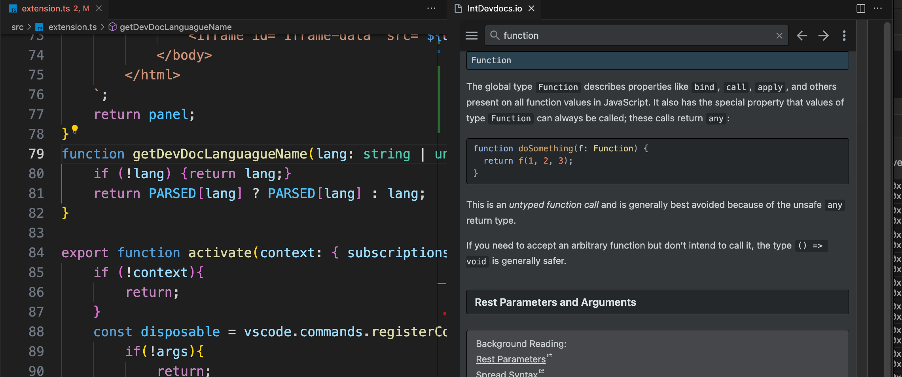

# Integrated Devdocs

> Logo by @Lucide/https://github.com/danielbayley

Search devdocs.io without leaving vscode, stay focused on what matters, your code.

## Usage

Select or leave the cursor pointer on the keyword you want to search, you then can:

Right click -> Select the "Search devdocs.io" option

OR

Windows: ctrl + R
Mac: cmd + R

An new tab will open on the right side of your editor with the desired search.

## Parameters

### URL

Need to use a custom/local instance of devdocs.io? Change the variable and the extension will point to it.
